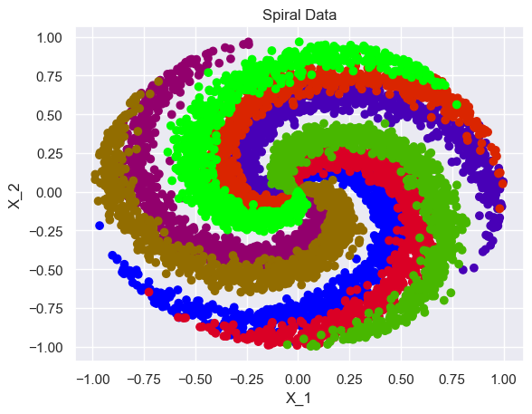
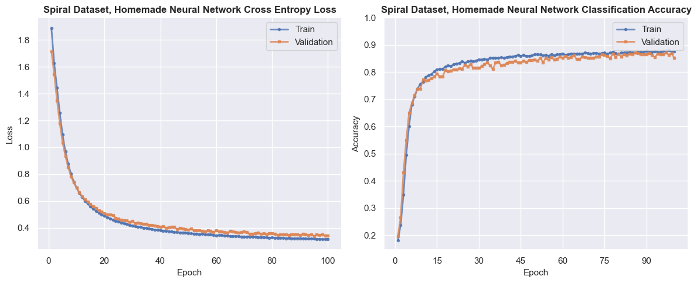
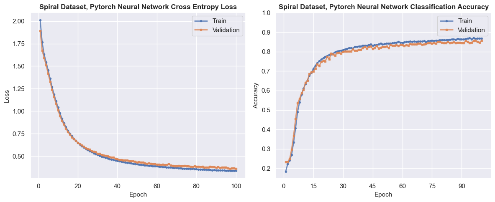
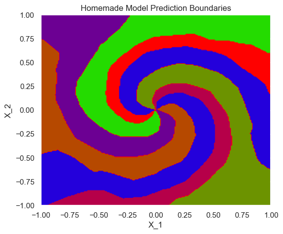
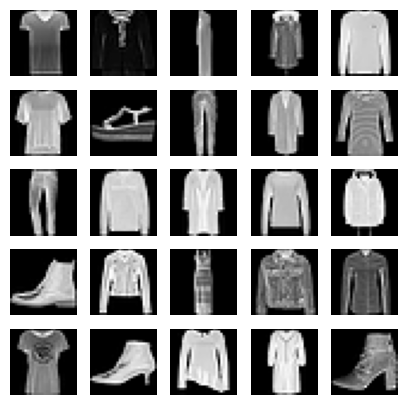
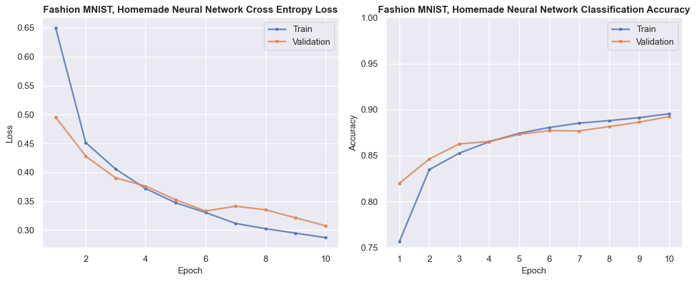
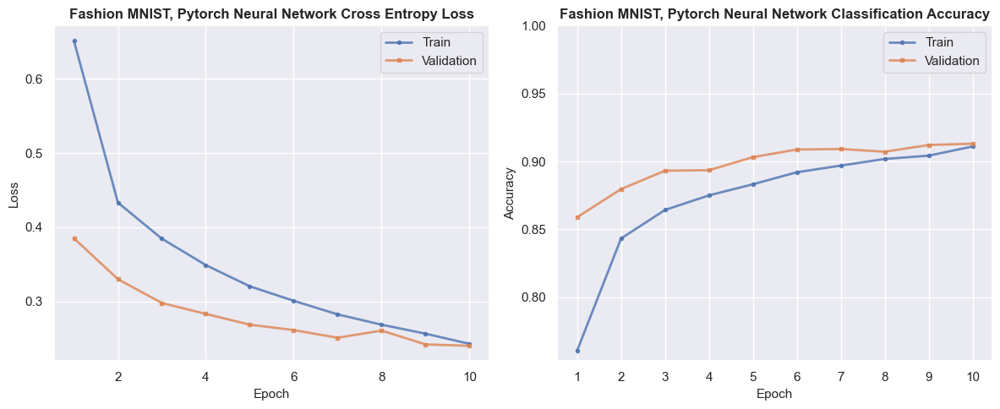

# Convolutional Neural Network From Scratch

## Project Overview

By building a fully functional Convolutional Neural Network from scratch, I developed a deeper understanding of one of deep learning's core concepts. The `/cnn` directory contains all the building blocks required to construct and train a CNN from the ground up. The `/models` directory demonstrates the implementation by training on two datasets and benchmarking performance against equivalent PyTorch models.

## Architecture

The `/cnn` directory contains modular components, each implemented in its own Python file. All layers inherit from a base `Module` class in `module.py`, which defines the forward and backward pass interface. The `Sequential` class orchestrates the training pipeline by chaining layers and coordinating forward propagation, backpropagation, and optimization.
```
cnn/
├── layers/       
│   ├── conv2d.py
│   ├── maxpool2d.py
│   ├── linear.py
│   ├── relu.py
│   ├── softmax.py
│   ├── flatten.py
│   └── dropout.py
├── loss/            
│   ├── cross_entropy_loss.py
│   ├── mse.py
│   └── loss_func.py
├── optim/  
│   ├── optimizer.py
│   └── adam.py
├── utils/           
│   └── utils.py
├── module.py        
└── sequential.py     
```

## Usage Example
```python
from cnn.layers import Linear, ReLU, Softmax
from cnn.loss import CrossEntropyLoss
from cnn.optim import Adam
from cnn.sequential import Sequential
from cnn.utils import train_val

# Define architecture
model = Sequential(
    layers=[
        Linear(D, 32),
        ReLU(),
        Linear(32, 16),
        ReLU(),
        Linear(16, K),
        Softmax()
    ],
    loss_func=CrossEntropyLoss(),
    optimizer=Adam(lr=1e-3)
)

# Train
train_losses, train_accuracies, val_losses, val_accuracies = train_val(
    model, X_train, y_train, X_val, y_val, 
    epochs=100, 
    batch_size=32, 
    verbose_freq=10
)
```


## Results

The `/models` directory contains experiments comparing my implementation against PyTorch models of identical architecture on two separate datasets. All training was performed locally on my Mac.

### Spiral Dataset 



In `/models/spiral.ipynb`, I trained a fully connected neural network on a 2D coordinate classification task with 8 classes. The dataset was borrowed from Stanford CS231n's course website. The model uses 3 linear layers with ReLU activations, trained with the Adam optimizer (lr=1e-3) and cross-entropy loss.
```python
ordered_layers = [
    Linear(2, 32),
    ReLU(),      
    Linear(32, 16),
    ReLU(),
    Linear(16, 8),
    Softmax()
]
```

| Metric | Custom Implementation | PyTorch Implementation |
|--------|----------------------|------------------------|
| Test Loss | 0.368 | 0.386 |
| Test Accuracy | 86.3% | 85.0% |
| Training Time | 5.2s | 14.6s |

| Custom Implementation | PyTorch Implementation |
|----------------------|------------------------|
|  |  |
|  |  |


### Fashion MNIST 



In `/models/fashion_mnist.ipynb`, I trained a convolutional neural network to classify 10 clothing items from the Fashion MNIST dataset. The model architecture is:
```python
ordered_layers = [
    Conv2d(in_channels=1, out_channels=16, kernel_size=3, stride=1, padding=1),
    ReLU(),
    MaxPool2d(kernel_size=2, stride=2),
    
    Conv2d(in_channels=16, out_channels=32, kernel_size=3, stride=1, padding=1),
    ReLU(),
    MaxPool2d(kernel_size=2, stride=2),

    Flatten(),

    Linear(1568, 128),
    ReLU(),
    Dropout(),
    
    Linear(128, 10),
    Softmax()
]
```

| Metric | Custom Implementation | PyTorch Implementation |
|--------|----------------------|------------------------|
| Test Loss | 0.310 | 0.223 |
| Test Accuracy | 89.3% | 91.6% |
| Training Time | 80m | 3m |

| Custom Implementation | PyTorch Implementation |
|----------------------|------------------------|
|  |  |


## References 

- [Neural Networks from Scratch](https://nnfs.io/) 
- [Stanford CS231n: Convolutional Neural Networks for Visual Recognition](https://cs231n.stanford.edu/) 
- [Vizuara - Building Neural Networks from Scratch](https://www.youtube.com/playlist?list=PLPTV0NXA_ZSj6tNyn_UadmUeU3Q3oR-hu) 
- [Andrej Karpathy - Autograd](https://www.youtube.com/watch?v=VMj-3S1tku0) 